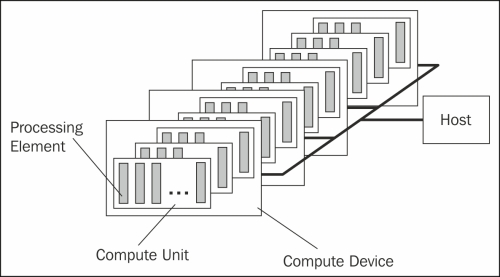
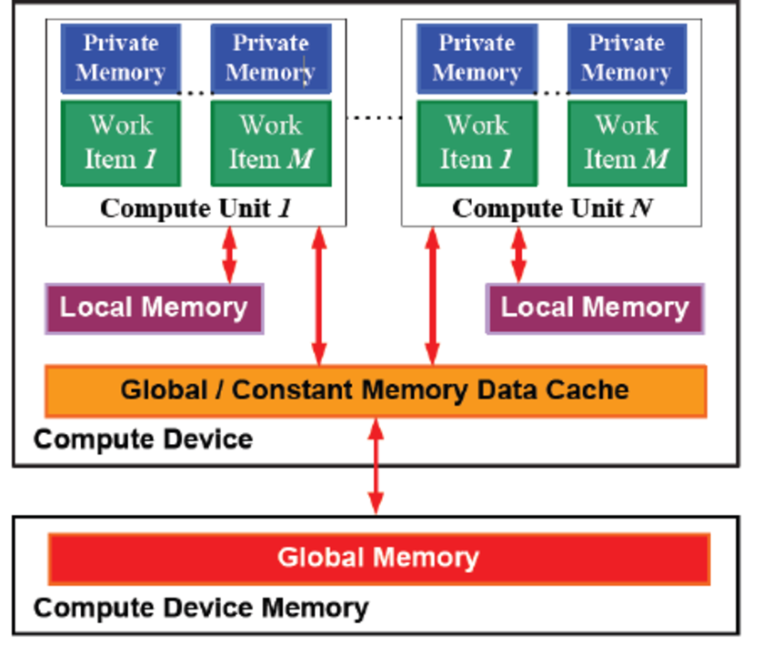

# OpenCL – Open Computing Language 
OpenCL lets Programmers write a single portable program that uses ALL resources in the heterogeneous platform. Open, royalty-free standard for portable, parallel programming of heterogeneous parallel computing CPUs, GPUs, and other processors.

One Host and one or more OpenCL Devices. Each OpenCL Device is composed of one or more Compute Units.
Each Compute Unit is divided into one or more Processing Elements.

Memory divided into host memory and device memory.

## OpenCL Memory Model

* Private Memory - Per Work-item
* Local Memory - Shared within a work-group
* Global Memory/Constant Memory - Visible to all work-groups 
* Host Memory - On the CPU

## Context and Command Queues
### Context
The environment within which kernels execute and in which synchronization and memory management is defined. 

The context includes:
* One or more devices
* Device Memory
* One or more command Queues 

All commands for a device (kernel execution, synchronization, and memory transfer operations) are submitted through a command-queue. Each command-queue points to a single device within a context.

